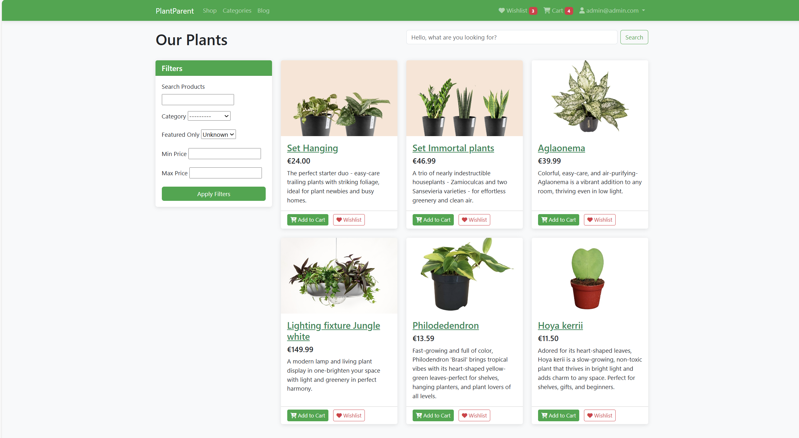
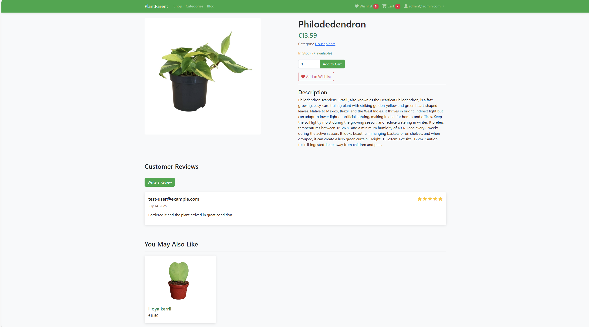
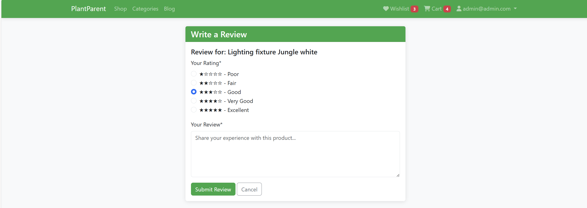
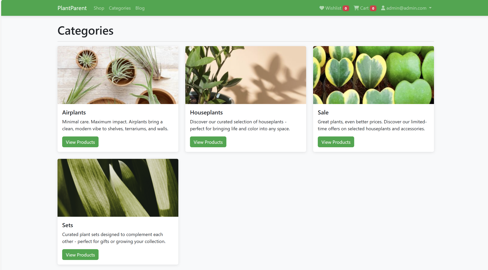
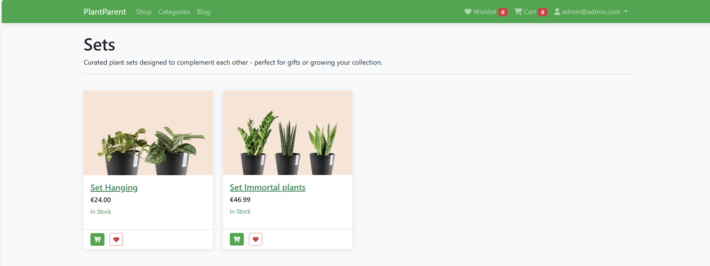
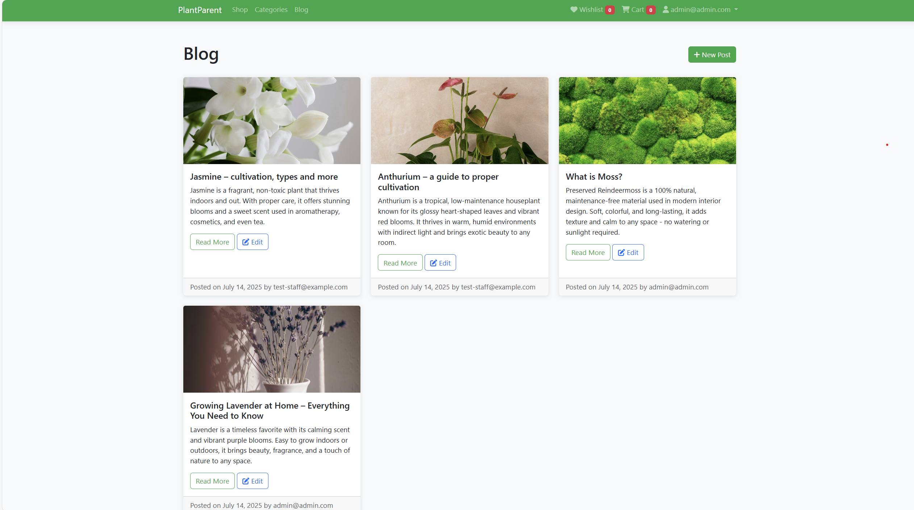
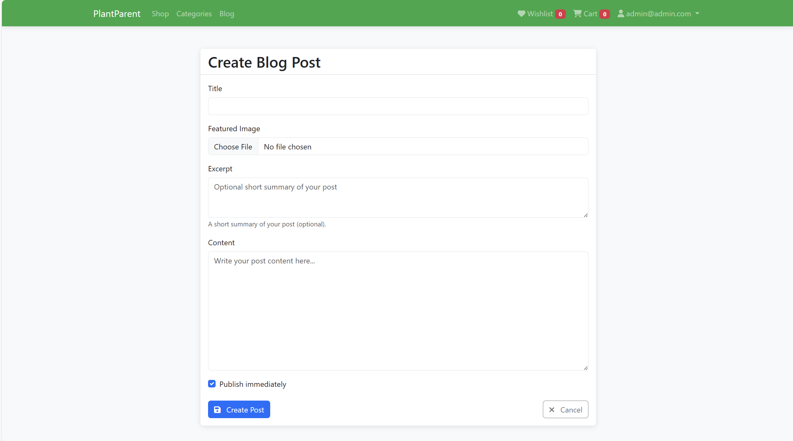

# PlantParent
PlantParent is a platform for plant lovers. Users can browse and purchase plants, read helpful articles on care and maintenance, rate products and content, etc.

## Home Page
The PlantParent homepage is designed to provide a welcoming and nature-inspired experience for visitors. It includes the following sections:
- **Header & Navigation** – Features the PlantParent logo, navigation menu (Shop, Categories, Blog), and quick access to Wishlist, Cart, Login, and Registration options.
- **Hero Section** – A large welcoming banner with the message “Anyone can Plant – The best season to start afresh” and a prominent Shop Now button to guide users to the store.
- **Featured Products** – A showcase of highlighted plants with images, names, and prices, allowing quick add-to-cart and wishlist actions.
- **Brand Story (Behind The Brand)** – A section explaining the company’s mission to provide rare and unique houseplants, with an accompanying lifestyle image.
- **Community Stats (Our Growing Community)** – Displays live statistics about users, blog posts, reviews, products, categories, likes, dislikes, and orders to showcase community growth.
- **Subscription Banner** – A call-to-action area encouraging visitors to subscribe for plant care tips, updates, and exclusive deals via email.
- **Footer** – Contains links to About, Shop, Payments, Delivery, Careers, FAQs, Contact Us, and social media channels, along with a short brand description and visual illustration.
  

## Login Page
A clean and simple interface where users can log in with their email and password. Includes options to remember login credentials and reset forgotten passwords. The page features a calming forest background to reflect the brand’s nature theme.
  

## Register Page
A user-friendly registration form where new users can create a PlantParent account. The form includes fields for email, first and last name, password setup with confirmation, and a required agreement to the Terms of Service and Privacy Policy. The design is enhanced with an illustration of a growing plant, symbolizing new beginnings.
  

## My Profile Page
The page allows authenticated users to manage their personal information and customize their account experience.
- **Access** – This page can be accessed by clicking on the logged-in user’s name in the navigation bar.
- **Profile Picture** – Users can upload or change their profile picture.
- **Personal Information** – Editable fields for first and last name, phone number, address, city, postal code, and country.
- **Preferences** – Option to subscribe to newsletters and promotional emails.
- **Controls** – Buttons to Update Profile and Cancel changes for better account management.
  
This page provides users with an easy and secure way to keep their information up to date while staying connected to PlantParent’s community and offers.
  

## Wishlist Page
The page allows authenticated users to save and manage products they are interested in purchasing later.
- **Access** – This page can be accessed by clicking the Wishlist icon in the navigation bar.
- **Wishlist Items** – Displays all products added to the wishlist with their name, price, and stock status.
- **Actions** – Remove an item from the wishlist & Add to Cart directly from the wishlist for a quicker checkout process.

This page helps users conveniently track desired products and easily move them to their shopping cart when ready to buy.
  

## Shopping Cart Page
- **Access** – Accessible from the Cart icon in the navigation bar.
- **Features** – Shows all products added to the cart with their price, quantity (editable), and total cost.
- **Actions** – Users can update item quantities, remove items, view the subtotal and shipping costs, and proceed to checkout.
  

## Checkout Page
- **Access** – Reached by clicking Proceed to Checkout from the shopping cart page.
- **Shipping Information** – Users fill in personal and address details.
- **Order Summary** – Displays products, quantities, and total cost including shipping.
- **Place Order** button to finalize the purchase.
  

## Order History Page
- **Access** – This page can be accessed by clicking on the logged-in user’s name in the navigation bar.
- **Features** – Displays a list of all past orders with details such as order number, date, status (e.g., Pending, Cancelled), total cost, and an action button to view more details.
- **Purpose** – Allows users to track and review their previous purchases and their current order status.
  

## Shop Page
The page displays all available plants for purchase and provides users with tools to easily find and add products to their cart or wishlist.
- **Access** – Accessible from the main navigation menu under the Shop link.
- **Product Listings** – Shows product images, names, prices, and short descriptions for each plant.
- **Filters & Search** –
  - Search bar to quickly find products by name.
  - Filter options by category, featured products, and price range.
- **Actions** – Users can:
  - Add to Cart to purchase products.
  - Add to Wishlist to save items for later.
  - Open a Product Detail Page to view more information about a specific plant, including a detailed description, features, and care instructions.

This page makes it simple for customers to browse, filter, and select plants, enhancing the shopping experience.
  

## Product Details Page
The Product Details page provides customers with complete information about a selected plant, enabling them to make informed purchasing decisions.
- **Access** – Reached by clicking on any product from the Shop or Featured Products sections.
- **Product Information** – Displays the product name, price, category, stock availability, and a detailed description including plant characteristics and care instructions.
- **Actions** – 
  - Add to Cart to include the product in the shopping cart.
  - Add to Wishlist to save the item for later.
- **Customer Reviews** – Shows reviews from other buyers, including ratings and comments.
- **Recommendations** – “You May Also Like” section suggests related plants to explore from the same category.

This page enhances the shopping experience by providing detailed product insights, social proof through reviews, and recommendations for similar plants.
  

## Write a Review Page
The Write a Review page allows authenticated users to share their experience with a specific product and provide valuable feedback for other customers.
- **Access** – Available by clicking the Write a Review button on a product’s details page.
- **Review Form** – 
  - **Rating** – A 5-star rating system where users can select from Poor to Excellent.
  - **Review Text** – A text area for writing detailed feedback about the product.
- **Actions** – 
  - **Submit Review** – Publishes the user’s feedback.
  - **Cancel** – Returns to the product details page without submitting.

This feature helps build community trust and assists future customers in making informed purchasing decisions.
  

## Categories Page
The page allows users to browse plants organized into different collections, making it easier to explore and shop by preference or occasion.
- **Access** – Available from the main navigation menu under Categories.
- **Category Listings** – Displays multiple plant categories, each with:
  - A representative image.
  - Category name and short description.
  - View Products button to see all plants within that category.

This page enhances navigation and helps customers quickly find plants based on their needs or interests
  

## Category Details Page
The Category Details page displays all products that belong to a selected category, helping users quickly browse items within their area of interest.
- **Access** – Reached by clicking View Products on any category from the Categories page.
- **Category Header** – Shows the category name and a brief description of what it offers.
- **Product Listings** – Displays all available products in the selected category, including:
  - Product image.
  - Name and price.
  - Stock availability.
- **Actions** – Users can:
  - Add to Cart to purchase immediately.
  - Add to Wishlist to save items for later.

This page streamlines navigation and ensures users can explore category-specific plants efficiently.
  

## Blog Page
The Blog page serves as a hub for plant care articles, guides, and news, helping users stay informed and inspired.
- **Access** – Available from the main navigation menu under Blog.
- **Purpose** – Enhances user engagement by offering helpful information about plant care, inspiration for home gardening, and updates on new products or tips.
- **Blog Posts** – Displays a collection of posts with:
  - Cover image.
  - Title and excerpt.
  - Publication date and author.
  - Buttons for Read More and, when permitted, Edit.
- **Admin Actions** – 
  - New Post and Edit Post buttons are visible only to users with administrative privileges or sufficient permissions.
  - Allows admins to create, update, and manage blog content directly from this page.
  

## Create Blog Post Page
The Create Blog Post page is designed for administrators and authorized users to add new content to the PlantParent blog.
- **Access** – Available only to users with administrative privileges or posting rights, accessible via the + New Post button on the Blog page.
- **Post Creation Form** –
  - **Title** – Field for entering the blog post title.
  - **Featured Image** – Option to upload an image to represent the post.
  - **Excerpt** – An optional short summary of the blog content.
  - **Content** – Main body area where the full post is written.
- **Publishing Options** – 
  - Checkbox to Publish immediately or save as a draft.
  - Create Post button to finalize and publish the blog entry.
  - Cancel button to discard changes and return to the blog overview.

This page allows admins to efficiently create informative and visually appealing articles, enhancing user engagement on the platform.
  

## Edit Blog Post Page
The Edit Blog Post page allows administrators and authorized users to update and manage existing blog content.
- **Access** – Available only to users with administrative privileges or editing rights. Accessed by clicking the Edit button on a blog post from the Blog page.
- **Post Creation Form** –
  - **Title** – Editable field for updating the blog post title.
  - **Featured Image** – Option to change or remove the current featured image.
  - **Excerpt** – Field for modifying the short summary of the post.
  - **Content** – Editable main body text for revising the post’s full content.
- **Publishing Options** – 
  - Checkbox to Publish immediately or save changes as a draft.
  - Update Post button to save and apply edits.
  - Cancel button to discard changes and return to the blog overview.

This page ensures that blog posts can be easily maintained, updated with new information, or refined to improve reader engagement.
  

