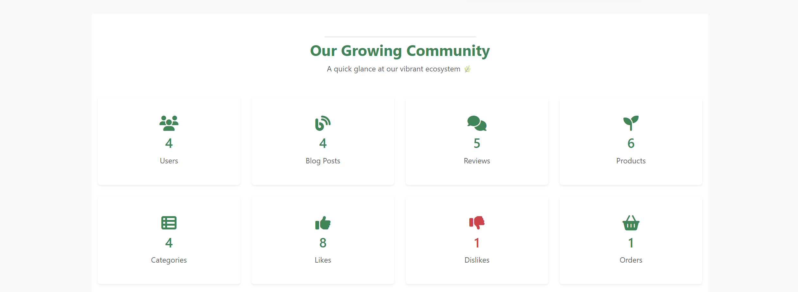

# PlantParent
PlantParent is a platform for plant lovers. Users can browse and purchase plants, read helpful articles on care and maintenance, rate products and content, etc.

## Home Page
The PlantParent homepage is designed to provide a welcoming and nature-inspired experience for visitors. It includes the following sections:
- **Header & Navigation** – Features the PlantParent logo, navigation menu (Shop, Categories, Blog), and quick access to Wishlist, Cart, Login, and Registration options.
- **Hero Section** – A large welcoming banner with the message “Anyone can Plant – The best season to start afresh” and a prominent Shop Now button to guide users to the store.
- **Featured Products** – A showcase of highlighted plants with images, names, and prices, allowing quick add-to-cart and wishlist actions.
- **Brand Story (Behind The Brand)** – A section explaining the company’s mission to provide rare and unique houseplants, with an accompanying lifestyle image.
- **Community Stats (Our Growing Community)** – Displays live statistics about users, blog posts, reviews, products, categories, likes, dislikes, and orders to showcase community growth.
- **Subscription Banner** – A call-to-action area encouraging visitors to subscribe for plant care tips, updates, and exclusive deals via email.
- **Footer** – Contains links to About, Shop, Payments, Delivery, Careers, FAQs, Contact Us, and social media channels, along with a short brand description and visual illustration.
  

## Login Page
A clean and simple interface where users can log in with their email and password. Includes options to remember login credentials and reset forgotten passwords. The page features a calming forest background to reflect the brand’s nature theme.
  

## Register Page
A user-friendly registration form where new users can create a PlantParent account. The form includes fields for email, first and last name, password setup with confirmation, and a required agreement to the Terms of Service and Privacy Policy. The design is enhanced with an illustration of a growing plant, symbolizing new beginnings.
  

## My Profile Page
The page allows authenticated users to manage their personal information and customize their account experience.
- **Access** – This page can be accessed by clicking on the logged-in user’s name in the navigation bar.
- **Profile Picture** – Users can upload or change their profile picture.
- **Personal Information** – Editable fields for first and last name, phone number, address, city, postal code, and country.
- **Preferences** – Option to subscribe to newsletters and promotional emails.
- **Controls** – Buttons to Update Profile and Cancel changes for better account management.
  
This page provides users with an easy and secure way to keep their information up to date while staying connected to PlantParent’s community and offers.
  

## Wishlist Page
The page allows authenticated users to save and manage products they are interested in purchasing later.
- **Access** – This page can be accessed by clicking the Wishlist icon in the navigation bar.
- **Wishlist Items** – Displays all products added to the wishlist with their name, price, and stock status.
- **Actions** – Remove an item from the wishlist & Add to Cart directly from the wishlist for a quicker checkout process.

This page helps users conveniently track desired products and easily move them to their shopping cart when ready to buy.
  

## Shopping Cart Page
- **Access** – Accessible from the Cart icon in the navigation bar.
- **Features** – Shows all products added to the cart with their price, quantity (editable), and total cost.
- **Actions** – Users can update item quantities, remove items, view the subtotal and shipping costs, and proceed to checkout.
  

## Checkout Page
- **Access** – Reached by clicking Proceed to Checkout from the shopping cart page.
- **Shipping Information** – Users fill in personal and address details.
- **Order Summary** – Displays products, quantities, and total cost including shipping.
- **Place Order** button to finalize the purchase.
  

## Order History Page
- **Access** – This page can be accessed by clicking on the logged-in user’s name in the navigation bar.
- **Features** – Displays a list of all past orders with details such as order number, date, status (e.g., Pending, Cancelled), total cost, and an action button to view more details.
- **Purpose** – Allows users to track and review their previous purchases and their current order status.
  

